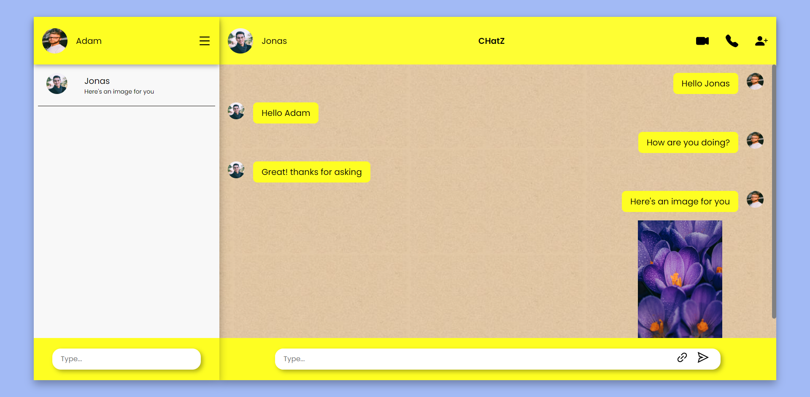
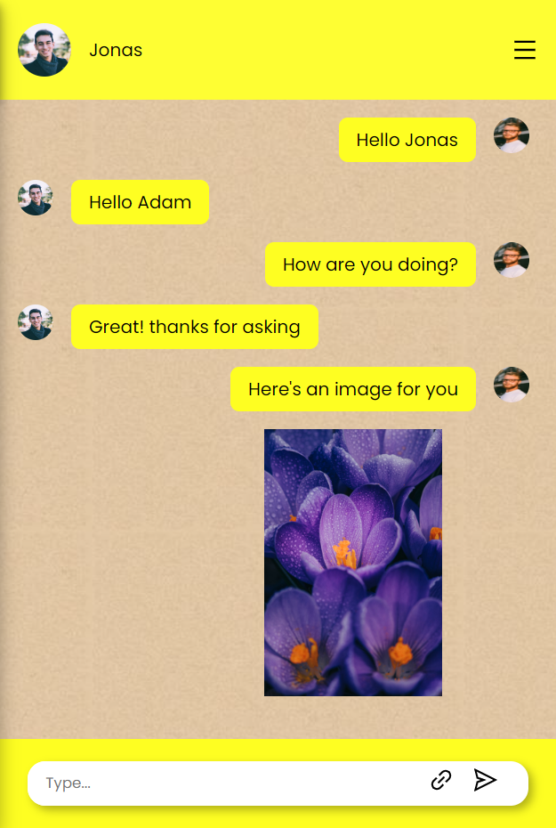

# Chat Application with React 18, SASS/SCSS and Firebase
> This is a fully responsive chat application created using React, styled with SASS/SCSS. It gives you realtime chatting experience with your friends. It has proper authentication system with sign in and log out functionality. The project is hosted using netlify.  
## Table of Contents
- [TechStack](#techstack)
- [Screenshot](#screenshot)  
- [Links](#links)
- [Author](#author)

## TechStack  
- ReactJS
- SASS/SCSS
- React Router
- Firebase  
## Screenshot

  

  

## Links
Live Site - [Live Site Url here](https://strong-lollipop-0d4856.netlify.app/)
## Author
GitHub - [@Sourabh358](https://github.com/SOURABH358)  
Frontend Mentor - [@Sourabh358](https://www.frontendmentor.io/profile/sourabh358)  
❤ **Sourabh Yadav**
